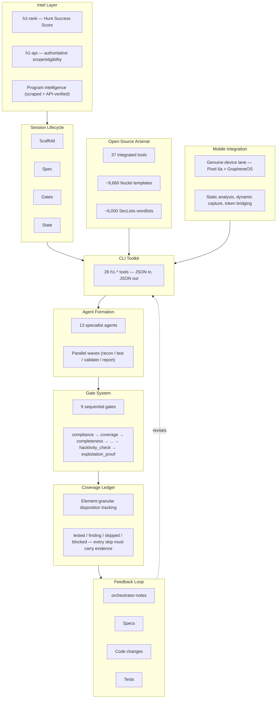

# H1 Security Lab

**What happens when an AI agent is the orchestrator of a real bug bounty operation — not the assistant to one.**

H1 Security Lab is a CLI-first system in which Claude Code itself is the hunter. There is no human driving a scanner and asking Claude to summarize output. Instead, roughly thirty custom command-line tools emit structured JSON, Claude reasons directly over that JSON, decides which tool to run next, chains tools into attack chains, and is gated the whole way by a sequence of quality checks that force proof before any finding gets written up. The brain is the orchestrator; the tools are just hands. This repo is a sanitized walkthrough of that architecture, built and refined across dozens of real, authorized HackerOne hunts.

## What This Is / What This Is NOT

**This IS:**
- A methodology showcase — how an AI orchestrator plans, executes, and self-polices a security research workflow
- An agentic-architecture reference — gate systems, coverage ledgers, multi-agent formations, feedback loops from findings back into tooling
- A set of honest case studies — including null results and rejected submissions, not just wins

**This IS NOT:**
- An exploit toolkit or payload library
- A vulnerability scanner you point at a URL
- A "push a button, find bugs" product
- A replacement for authorized scope, program rules, or human judgment on severity

Every hunt documented here was run against a program that publicly invited outside researchers to test it, under that program's own disclosure and safe-harbor policy. Nothing here is a general license to test anything. See [DISCLAIMER.md](DISCLAIMER.md).

## Quick Stats

| Metric | Count |
|---|---|
| Custom CLI tools (`h1-*`) | 26 |
| Specialist AI agents | 13 |
| Sequential quality gates | 9 |
| Open-source tools integrated | 37 |
| Nuclei templates available | ~9,660 |
| SecLists wordlists available | ~6,000 |
| Automated tests | 860+ |
| Real hunts executed | 22 |

## Architecture

Each layer exists because an earlier version of this system failed without it: the gate system exists because early hunts shipped unproven claims; the coverage ledger exists because "looks secure" and "was actually tested" turned out to be different things; the feedback loop exists because every real hunt surfaces friction that should become a tool, not a one-off workaround.

## Documentation

| Chapter | Topic |
|---|---|
| [01 — The Thesis](docs/01-thesis.md) | Why an AI orchestrator, not an AI assistant |
| [02 — System Architecture](docs/02-architecture.md) | The 9-layer system design |
| [03 — CLI Toolkit](docs/03-cli-toolkit.md) | The 26 `h1-*` tools and what each one owns |
| [04 — Open-Source Arsenal](docs/04-opensource-arsenal.md) | How 37 external tools are wired in |
| [05 — Agent Formation](docs/05-agent-formation.md) | 13 specialists, parallel waves, handoffs |
| [06 — Gate System](docs/06-gate-system.md) | The 9 gates and why each one exists |
| [07 — Coverage Ledger](docs/07-coverage-ledger.md) | Element-granular accounting, backed skips |
| [08 — Target Selection](docs/08-target-selection.md) | Hunt Success Score — edge-maximizing program ranking |
| [09 — Mobile Integration](docs/09-mobile-integration.md) | Genuine-device testing on a real Pixel 6a |
| [10 — Decision Rules](docs/10-decision-rules.md) | Pattern-matched hunting doctrine |
| [11 — Self-Improvement Loop](docs/11-self-improvement-loop.md) | How notes become specs become code become tests |
| [12 — Case Studies](docs/12-case-studies.md) | Real hunts, sanitized: wins, nulls, and a rejection |
| [13 — Test Suite](docs/13-test-suite.md) | 909 tests — what's verified and what isn't |
| [14 — Lessons and Limits](docs/14-lessons-and-limits.md) | What gates can't certify, and what still needs a human |

See [DISCLAIMER.md](DISCLAIMER.md) for authorization scope, safe-harbor context, and the limits of this showcase.

## Built With

- **[Claude Code](https://claude.com/claude-code)** (Anthropic) — the orchestrator itself; Claude reasons over tool output and drives the hunt
- **[HackerOne](https://hackerone.com)** — the coordinated-disclosure platform every program in this repo runs on
- **The open-source security tool ecosystem** — Nuclei, SecLists, jsluice, ffuf, and dozens of others wired into the toolkit; see [04 — Open-Source Arsenal](docs/04-opensource-arsenal.md) for the full list and attribution

---

*Prove it or kill it. No theoretical findings, no inflated severity — every claim in this repo's case studies is backed by observed evidence.*
