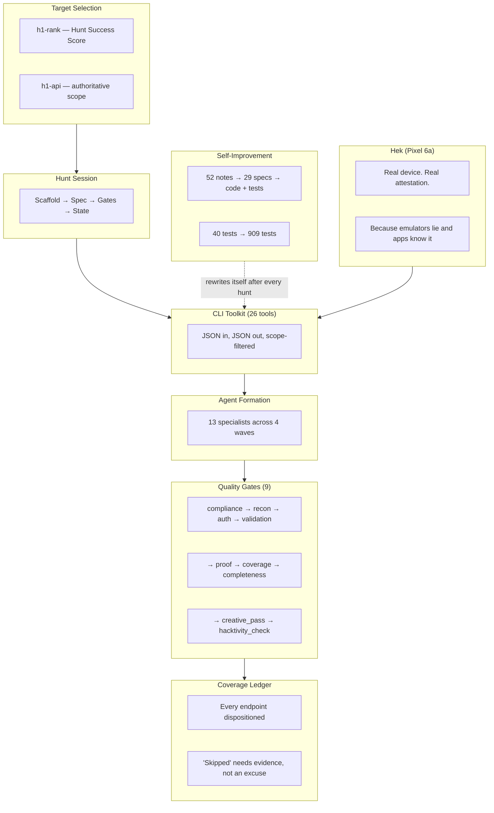

# H1 Security Lab

**Total bounties earned: $0.**

Not for lack of trying. Two submissions, 22 hunts, 24,000 lines of custom tooling, 909 automated tests, a physical phone named Hek, and a 9-gate quality system that exists entirely because the early versions of this project would have submitted a CORS misconfiguration and called it a day.

The one finding we did submit — a real IDOR on a fitness wearable company's API, validated, evidenced, every gate green — was closed as a duplicate of someone else's private report from two weeks earlier. We found a real bug, proved it was real, wrote it up professionally, and collected exactly nothing for the trouble.

This is the story of that system.

## What Happened Here

H1 Security Lab is what happens when you hand an AI agent a Pixel phone, 37 open-source security tools, and a HackerOne account, then tell it to go find vulnerabilities in programs that publicly invited outside researchers to test them. Not "parse this scan output" — actually run the hunt. Pick the target. Map the surface. Get authenticated. Test every reachable endpoint. Prove the bug or prove you tested everything and it's clean. Write the report. And when the system inevitably declares a target "secure" while a real bug sits in a class marked "skipped" — figure out why and rewrite the methodology so it can't happen again.

The brain is Claude Code running in a terminal. The hands are 26 custom CLI tools that all speak JSON. The conscience is a 9-gate quality system where each gate is a scar from a specific past failure.

This repo is the sanitized, open-source walkthrough of that architecture.

## The Scoreboard (Honest Version)

| Metric | Number | Context |
|---|---|---|
| Bounties collected | **$0.00** | Two submissions. One rejected (missing proof). One duplicate (someone else found it first, privately) |
| Real hunts run | **22** | Against live HackerOne programs, each one publicly inviting researchers to test |
| Custom CLI tools | **26** | ~24,000 lines of Python. Each exists because parsing stdout with regex stopped being "fine" |
| Specialist AI agents | **13** | One is exclusively responsible for IDOR testing and will not accept other assignments. Parallel execution was documented for 7 months before anyone actually ran it |
| Quality gates | **9** | Started at 5. Each new one is a scar from a specific failure. The last one exists because a validated finding turned out to be a duplicate |
| Automated tests | **909** | Up from 40 six months ago. Nobody planned 909 tests — they accreted, one per mistake that was never going to happen twice |
| Orchestrator-notes filed | **52** | Dated friction observations from live hunts. The honest mistake journal. Titles like `ripio-second-account-acquisition-no-fallback-blocks-differential-idor.md` |
| Improvement specs authored | **29** | Each one turns a cluster of notes into code changes and tests. The system literally rewrites itself after every hunt |
| Open-source tools integrated | **37** | subfinder, nuclei, ffuf, frida, jsluice, mitmproxy, and 31 others doing the real probing. We just made them speak JSON |
| Total earnings per line of code | **$0.00 / 24,000** | We try not to think about this |

## The Stories That Built the System

These aren't hypotheticals. They're from the orchestrator-notes — dated, evidenced, and now encoded into the architecture as permanent rules.

### The Bug That Was Hiding in "Skipped"

A hunt against a fitness wearable company finished with all 8 gates green. Dashboard: clean. Conclusion: "no finding, target is secure." The human operator said: *"I don't believe this surface is bug-free. There MUST be a bug."*

On re-examination — actually testing endpoints the system had marked "skipped" with a plausible-sounding reason — a real Medium IDOR fell out in 20 minutes. One endpoint returned a full roster of user data to a non-member. A closely related sibling endpoint correctly returned 403. The inconsistency had been hiding in plain sight.

The gates had been green because over 85% of the surface was dispositioned as "skipped" — stamped as accounted-for without being tested. The reason given for each skip was individually plausible. The gate measured "is every cell dispositioned?" not "was every reachable endpoint actually hit?" A green dashboard with a live bug. The dashboard was not wrong — it just wasn't measuring what we thought it was measuring.

That lesson is now two rules: skips require live probe evidence or a typed justification (not just a reason string), and a high ratio of unbacked skips fails the gate outright.

### The 142 Routes That Were All "Secure"

During the same hunt, a Python/urllib sweep against the target's Cloudflare-fronted API hit 142 routes. Every single one came back `403`. At a glance: strong, uniform authorization. Every endpoint locked down. Time to move on.

It was actually a Cloudflare JA3 fingerprint ban. urllib's TLS handshake was being identified as automation. The `403` wasn't from the application — it was from Cloudflare, and the requests never reached the target's servers at all. Every response body was byte-identical: `error code: 1010`.

Re-running the same requests through curl — which has a tolerated TLS fingerprint — produced the real distribution: 405x44, 404x43, 403x27, 200x13, 400x10, 401x4, 500x1. Thirteen endpoints were returning `200` to unauthenticated requests. The "secure" wall was a CDN politely refusing to speak to us.

The system now treats a uniform status pattern against a CDN-fronted host as `transport_blocked` (inconclusive), never as "secure."

### The Target We Picked Because We Could Do Something Others Can't (And Then Couldn't)

Ripio, a crypto exchange, scored high on the Hunt Success Score specifically because our two-account IDOR capability — where having two real test accounts lets you test whether User A can access User B's data — was a strong edge against their architecture. That was the reason we picked it.

Account A worked fine. Account B registered successfully three times. Three email-confirmation resends. Forty minutes of waiting. The confirmation email never arrived. `401: "User could not authenticate."` The entire differential-IDOR dimension — the reason we picked this target — went completely unexercised.

The system now starts second-account acquisition in parallel with first-account testing, so a broken email pipeline overlaps other work instead of blocking the highest-value lane at the end of the hunt.

### The Most Sophisticated Bypass in the Toolkit

A live-auction social commerce app pinned its TLS certificates, checked device attestation, and fingerprinted TLS handshakes. The standard mobile testing playbook — root a phone, install Frida, run mitmproxy — failed every single check simultaneously. The app didn't crash or throw an error. It just quietly stopped talking to its own backend, which from a debugging standpoint is worse.

The bypass that actually worked: open Chrome on the real phone, navigate to the web login page, type in the credentials, and read the session token off the browser's network traffic. The most sophisticated bypass in the toolkit is logging in. That technique — real browser, real device, real login, no proxy — is now a productized CLI command with its own gate and its own readiness check. It was also the lab's first live proof that a certificate-pinned mobile target could still be fully tested without touching the mobile app at all.

### The Prestige Target

The scoring model's first version ranked Netflix #1. Highest profitability score in the fleet. We hunted it. Coverage tested: 1.4%. Auth session: never obtained. Twenty HIGH-priority items still open. Netflix has paid out over $6 million in bounties on HackerOne. None of it to us. The submission — a CORS misconfiguration — came back "Not Applicable." Permissive CORS without demonstrated sensitive-data access isn't a finding; it's a misconfigured header.

That rejection produced three permanent rules: a CORS finding now requires proof of sensitive data on the endpoint, proof of cookie-based auth, and a working cross-origin exfiltration PoC before it can be written up at all. The scoring model was also rewritten from "prestige-weighted" to "profitability-weighted," because chasing programs where the world's best researchers are already parked is a strategy for losing politely.

## What This Is / What This Is NOT

**This IS:**
- A methodology showcase — how an AI orchestrator plans, executes, and ruthlessly self-audits a security research workflow
- An agentic-architecture reference — 26 JSON-speaking CLI tools, 13 specialist agents, 9 sequential gates, and a coverage ledger that forces you to account for every endpoint you touched or didn't
- Brutally honest case studies — including the time the system declared a target secure, got corrected by the human, submitted the finding, and then lost to a duplicate anyway

**This IS NOT:**
- An exploit toolkit (sorry)
- A vulnerability scanner you point at a URL and pray (those exist; they're called "noise generators")
- A "push a button, get bounties" product (if that existed, bug bounties would pay minimum wage and we'd have made at least *some* of it)
- A replacement for reading the program rules before you start testing (the system literally won't let you skip this step — it tried, we added a gate)

Every hunt documented here was run against a program that publicly invited outside researchers to test it, under that program's own coordinated-disclosure and safe-harbor policy. See [DISCLAIMER.md](DISCLAIMER.md).

## Architecture

Every layer exists because an earlier version failed without it.

## The Chapters

| # | Chapter | What You'll Learn |
|---|---------|-------------------|
| 01 | [The Thesis](docs/01-thesis.md) | Why "AI orchestrator" not "AI assistant" — and why the distinction actually matters |
| 02 | [System Architecture](docs/02-architecture.md) | Nine layers, each one a reaction to a specific failure |
| 03 | [CLI Toolkit](docs/03-cli-toolkit.md) | 26 tools that turn raw security tool output into something an AI can reason about |
| 04 | [Open-Source Arsenal](docs/04-opensource-arsenal.md) | The 37 tools doing the real probing while we take the credit |
| 05 | [Agent Formation](docs/05-agent-formation.md) | 13 specialists in 4 waves — and how "parallel agents" was a PowerPoint slide for 7 months |
| 06 | [Gate System](docs/06-gate-system.md) | 9 gates. Each one a scar. "Gates certify accounting, not attack" is the most important sentence in the system |
| 07 | [Coverage Ledger](docs/07-coverage-ledger.md) | How "we tested for IDOR" became "we tested *this endpoint* and got *this 403*" |
| 08 | [Target Selection](docs/08-target-selection.md) | Why we stopped chasing Netflix and started hunting where bugs are actually findable |
| 09 | [Mobile Integration](docs/09-mobile-integration.md) | A real phone, a privacy OS, and the reason emulators fail attestation |
| 10 | [Decision Rules](docs/10-decision-rules.md) | 40+ "if you see X, do Y" rules — each one a lesson someone paid for |
| 11 | [Self-Improvement Loop](docs/11-self-improvement-loop.md) | The system rewrites itself after every hunt. The version from 6 months ago would embarrass us |
| 12 | [Case Studies](docs/12-case-studies.md) | Four hunts told honestly: the humbling, the clean kill, the proof of concept, and the one where the email just never arrived |
| 13 | [Test Suite](docs/13-test-suite.md) | 909 tests, each one commemorating a specific mistake that was never going to happen twice |
| 14 | [Lessons and Limits](docs/14-lessons-and-limits.md) | Everything we got wrong, can't do, and still need a human for |

## Built With

- **[Claude Code](https://claude.com/claude-code)** (Anthropic) — the orchestrator. It doesn't assist the hunt; it *is* the hunt.
- **[HackerOne](https://hackerone.com)** — the coordinated-disclosure platform. Every target here published a scope table saying "please test this."
- **The open-source security tool ecosystem** — subfinder, nuclei, ffuf, frida, jsluice, mitmproxy, and 31 others. We just made them speak JSON. [Chapter 4](docs/04-opensource-arsenal.md).
- **One Pixel 6a named Hek** — running GrapheneOS, connected over wireless ADB through a WireGuard tunnel, passing attestation checks that emulators can't. It has opinions about being rebooted. Its wireless-debugging port drifts on every reboot, and once we spent an hour debugging the phone only to discover the problem was that Linux ships an `adb` binary from 2019 that silently lacks the command we needed. The phone was fine. The phone was always fine.

---

*Prove it or kill it. No theoretical findings. No inflated severity. Every claim needs observed evidence.*

*And when the dashboard says green, check what "green" is actually measuring. We learned that one the hard way. Twice.*

*The test suite has more tests than most of the programs we hunt have endpoints. We're not sure if that's impressive or a cry for help.*
