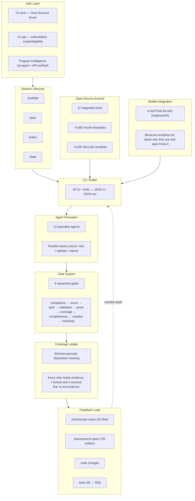

# H1 Security Lab

**An AI that hunts bugs for a living. Mostly it finds its own.**

H1 Security Lab is what happens when you hand an AI agent a Pixel phone, 37 security tools, and a HackerOne account, then tell it to go find vulnerabilities. Not "summarize this scan output" — actually orchestrate the hunt. Pick the target. Run the recon. Decide what to test. Prove the bug exists. Write the report. And when it inevitably calls a target "secure" while a real bug hides in a class it marked "skipped" — rewrite its own methodology so it can never make that mistake again.

The brain is Claude Code running in a terminal. The hands are 26 custom CLI tools that speak JSON. The conscience is a 9-gate quality system that exists entirely because the early versions of this system had none.

This repo is the sanitized walkthrough of that architecture — how it works, why each piece exists (spoiler: because something failed without it), and what happened across 22 real, authorized HackerOne hunts.

## What This Is / What This Is NOT

**This IS:**
- A methodology showcase — how an AI orchestrator plans, executes, and ruthlessly self-polices a security research workflow
- An agentic-architecture reference — because "I gave GPT my nmap output" is not an architecture
- A set of brutally honest case studies — including the time the system declared a target secure, got corrected by the human, and then the finding it submitted turned out to be a duplicate anyway

**This IS NOT:**
- An exploit toolkit (sorry)
- A vulnerability scanner you point at a URL and pray (those exist, they're called "noise generators")
- A "push a button, find bugs" product (if that existed, bug bounties would pay minimum wage)
- A replacement for reading the program rules before you start testing (the system literally won't let you skip this step — it tried, we added a gate)

Every hunt documented here was run against a program that publicly invited outside researchers to test it, under that program's own disclosure and safe-harbor policy. Nothing here is a general license to test anything. See [DISCLAIMER.md](DISCLAIMER.md).

## The Scoreboard

| What | How Many | Commentary |
|---|---|---|
| Custom CLI tools (`h1-*`) | 26 | Each one exists because shelling out to raw tools and parsing stdout with regex was "fine" until it wasn't |
| Specialist AI agents | 13 | One of them is exclusively responsible for IDOR testing and gets upset if you give that work to anyone else |
| Sequential quality gates | 9 | Started at 5. Each new one is a scar from a specific failure |
| Open-source tools integrated | 37 | Standing on the shoulders of giants who wrote better fuzzers than we ever will |
| Nuclei templates | ~9,660 | More templates than most programs have endpoints |
| SecLists wordlists | ~6,000 | We have literally never used all of them |
| Automated tests | 909 | Up from 40 six months ago. Every spec adds tests. The test suite is the scar tissue |
| Real hunts executed | 22 | Findings: a few. Clean kills: several. Humbling lessons: plenty |

## Architecture

Each layer exists because an earlier version of this system failed without it. The gate system was born after early hunts shipped unproven claims. The coverage ledger was born after "looks secure" and "was actually tested" turned out to be embarrassingly different things. The feedback loop was born after we realized that making the same mistake on different targets isn't bad luck — it's a missing abstraction.

## The Chapters

| # | Chapter | What You'll Learn |
|---|---------|-------------------|
| 01 | [The Thesis](docs/01-thesis.md) | Why "AI orchestrator" not "AI assistant" — and why the distinction matters more than any individual exploit |
| 02 | [System Architecture](docs/02-architecture.md) | Nine layers, each one a reaction to a specific failure |
| 03 | [CLI Toolkit](docs/03-cli-toolkit.md) | 26 tools that turn "raw security tool output" into "something an AI can actually reason about" |
| 04 | [Open-Source Arsenal](docs/04-opensource-arsenal.md) | The 37 tools doing the real work while we take the credit |
| 05 | [Agent Formation](docs/05-agent-formation.md) | 13 specialists in 4 waves — and the story of how "parallel agents" was a PowerPoint slide until one hunt actually ran them |
| 06 | [Gate System](docs/06-gate-system.md) | 9 gates. Each one a scar. "Gates certify accounting, not attack" is the most important sentence in the whole system |
| 07 | [Coverage Ledger](docs/07-coverage-ledger.md) | How "we tested for IDOR" became "we tested *this specific endpoint* and got *this specific 403*" |
| 08 | [Target Selection](docs/08-target-selection.md) | Why we stopped chasing Netflix (spoiler: because everyone else is also chasing Netflix) |
| 09 | [Mobile Integration](docs/09-mobile-integration.md) | A real phone, a privacy-focused OS, and the reason emulators fail attestation checks |
| 10 | [Decision Rules](docs/10-decision-rules.md) | 40+ "if you see X, do Y" rules — each one a lesson someone learned the expensive way |
| 11 | [Self-Improvement Loop](docs/11-self-improvement-loop.md) | The system literally rewrites itself after every hunt. The version from 6 months ago would embarrass us |
| 12 | [Case Studies](docs/12-case-studies.md) | Four hunts told honestly: the humbling, the clean kill, the proof of concept, and the one where the target's email server just... didn't work |
| 13 | [Test Suite](docs/13-test-suite.md) | 909 tests that exist because "trust me, the gate works" was never a convincing argument |
| 14 | [Lessons and Limits](docs/14-lessons-and-limits.md) | Everything we got wrong, can't do, and still need a human for (it's more than you'd think) |

## The Highlight Reel (Honest Version)

**The Humbling:** System ran a full sweep on a fitness wearable company. All 8 gates green. Declared the target secure. The human said "look again." Found a real bug hiding in a class marked "skipped." Submitted it. It was a duplicate of someone else's private report from two weeks earlier. Both lessons now live in the architecture as permanent scars. ([Ch 12](docs/12-case-studies.md))

**The Clean Kill:** Tested a food delivery app with GraphQL introspection disabled. Mined 193 operations from webpack chunks instead. Dispositioned every single one. Zero findings — and that's the point. We can *prove* we tested everything reachable. ([Ch 12](docs/12-case-studies.md))

**The Wall:** Tried to test a crypto exchange. Account B's email verification just... never worked. Three registration attempts. Three resend attempts. Still "User could not authenticate." Marked it BLOCKED, not SKIPPED, because the system doesn't let you pretend you tested something you couldn't reach. ([Ch 12](docs/12-case-studies.md))

## Built With

- **[Claude Code](https://claude.com/claude-code)** (Anthropic) — the orchestrator. It doesn't assist the hunt; it *is* the hunt.
- **[HackerOne](https://hackerone.com)** — the coordinated-disclosure platform. Every target here published a scope table saying "please test this."
- **The open-source security tool ecosystem** — subfinder, nuclei, ffuf, frida, jsluice, mitmproxy, and 31 others doing the actual probing. We just made them talk JSON. See [Chapter 4](docs/04-opensource-arsenal.md).
- **One Pixel 6a named Hek** — running GrapheneOS, connected over wireless ADB, passing attestation checks that emulators can't. It has opinions about being rebooted.

---

*Prove it or kill it. No theoretical findings, no inflated severity. And when the system says "0 findings, clean kill" — that's not a failure, that's accountability.*

*The test suite has more tests than most of the programs we hunt have endpoints. We're not sure if that's impressive or a cry for help.*
